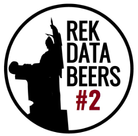

<!-- README.md is generated from README.Rmd. Please edit that file -->

```{r, include = FALSE}
knitr::opts_chunk$set(
  collapse = TRUE,
  comment = "#>"
)
```

# Databeers Reykjavík #2

This is the github repo for my [talk at Databeers #2 from September 16th 2022](https://bggj.is/databeers).

The slides are made using [Quarto's](Quarto.org) `revealjs` HTML output. Any custom theming can be found in the file `theme.scss`.


Checkout Reykjavík Databeers at [databeers.is](https://databeers.is)


{fig-align="center"}


The attendees were graciously gifted beers by the nice and friendly people at

{fig-align="center"}